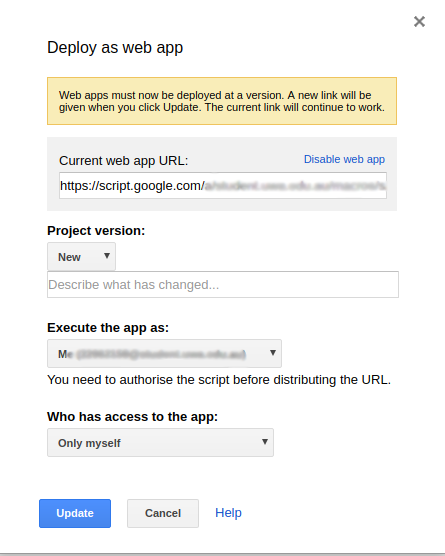

# Sentiment Analytics: Back End
[](https://travis-ci.org/krinj/cits3200-f-backend)

This is the back-end, serverless application for the Sentiment Analytics app for CITS 3200. The purpose of the App is to receive survey response submissions from Qualtrics, process those responses via the Google Natural Language API, and upload the results to a Google BigQuery table.


## Contents

* [Overview](#overview)
* [Setup](#setup)
* [Configuration](#configuration)
* [Question ID](#question-id)
* [API](#api)


## Overview

* The App is serverless, and is hosted on [Google App Engine](https://cloud.google.com/appengine/), Python standard environment.
* This repository has been set up with automatic deployment via [Travis CI](https://travis-ci.org/krinj/cits3200-f-backend). This means that every push to master should commence a deployment to App Engine.
* The App's API endpoint can be found here: https://backend-dot-cits-3200.appspot.com/
* The App has a function to submit test data, submit manual data, or submit data extracted from a Qualtrics API. More information on this later.


## Setup

This App has been configured to use GCP services on the account for `sentiment.analysis@learningforpurpose.org`. To follow this setup, please make sure you have access to GCP on this account.

#### Service Credentials

> Note: This step has already been completed for this reposistory. You should only need to do this again if the previous setup is no longer working, or you want to set up a new repository with another GCP user.

To use GCP services on an account, you must first have a copy of the service account key (this is usually a JSON file). [Click here to see the official instructions](https://cloud.google.com/iam/docs/creating-managing-service-account-keys). This will allow this App to log in and use the services.

But we do not want to store this key publicly, so we can let Travis encrypt it for us. [The official instructions are here](http://docs.travis-ci.com/user/encrypting-files/). Basically, copy the `json` credential file to the same directory as the Travis and run:

```bash
travis encrypt-file client-secret.json --add
```

This will create the secret keys on your Travis account, and also produce an encoded version of your credentials file. Travis will automatically decrypt this during the build process.

#### App Engine

[Make sure that GCP has the App Engine service enabled](https://cloud.google.com/endpoints/docs/frameworks/enable-api). Most of the setup for App Engine should already be in the `app.yaml` file.

```
service: backend
runtime: python37
```

> By default, this App will be created under the service name `backend`. I do believe though that App Engine also requires at least one app without a defined service name (i.e. default service) in order to function. So if it errors, you might need to create a simple default service, or just uncomment this line to deploy it to the default tag

#### Submit Last Hour Hourly Trigger - Apps Scripts

The Submit Last Hour API is required and the App Engine must be set up before setting this up.

The hourly trigger uses Google Apps Script to execute our Submit Last Hour API. It checks for all missed responses that have not been added to BigQuery in the past hour. This serves as a backup operation when there are an overload of responses (multiple responses submitted at almost the same time). It is recommended to set this up in order to avoid the issue, an alternative would be using the Submit All API manually but the hourly trigger is automatic once it is set up.

Go to [Google Apps Scripts](https://script.google.com/) and login using the same Google account used for App Engine and open this [link](https://script.google.com/d/1M9Th7QpKKm8a5rQTFWpguinEG0W-bv5mXq0tDu34Ee-DTYpJxo-yccOc/edit?usp=sharing). The page opened should look like below.


The project will be opened and click "File" and click "Make a copy...". You will be redirected to another page or another page will be opened with the project name "Copy of..." and now you can edit your project. you may close the first page opened from the link.


Click the project name and you can rename the project to any name, this will take a while as the project changes its name. You can also rename the code's file name.

Project name:


Code file name:


Now, edit the code by changing "XXXXXX" (inside the quotations) into its actual value.

```javascript
var surveyId = 'XXXXXX'; // change to your qualtrics survey's survey id
var token = 'XXXXXX'; // change to your qualtrics token
var dataCenter = 'ca1'; // change to your qualtrics data center, default: "ca1"
```

The survey id and the Qualtrics token can be retrieved from Qualtrics, go to Qualtrics and make sure you are logged in your Qualtrics account, after logged in open "Account Settings".


Then open "Qualtrics IDs", there you can find the survey ids and your Qualtrics token.


The data center is defaulted to "ca1", and you might not need to change it unless your Qualtrics account uses a specific data center. You can find out your data center [here](https://api.qualtrics.com/docs/root-url). After changing everything, save your changes by CTRL+S or going through the FIle menu.

After saving your changes, now click the icon for "triggers".


Add a new trigger by clicking "No triggers set up. Click here to add one now.".


Make sure the it has the same values selected.


You will be prompt with an "Authorisation required" message, click review permissions and sign in with the same Google Account, and then click allow to allow access.


Now click "Publish" and click "Deploy as web app...".


Fill in the field of Project Version with anything and click update.



The Hourly Trigger Google Apps Scripts App is now set up. You can revisit "Publish" and "Deploy as app..." to "Disable" the web app or update it with new changes.


## Question ID

In order to set up the survey for the pipeline to process, we must use some specific question tags to tell the back-end which questions to process. Any fields without the tagged questions will be ignored. A survey should contain each one of the tag options, otherwise it might not process properly.


| Tag   | Description                                                  |
| ----- | ------------------------------------------------------------ |
| `YOB` | Year of birth.                                               |
| `ABN` | This key should be used to store the 11 digit ABN of the organization. |
| `ORG` | The organization that this person belongs to.                |
| `GEN` | Gender.                                                      |
| `EMP` | Employment status.                                           |
| `NLP` | Any question tagged with `NLP` at the start will be processed as a NLP text question. For example: `NLP_Q1` and `NLP_Q2` will be processed by the pipeline. `Q3` will not. |


## Configuration

There are a couple of fields hard-coded into the `main.py` script (which is the main program). This helps to define the settings for the app. You should not need to modify these unless you want to change the host for the GCP project.

You may modify these fields, and re-commit the repository to change the hard-coded settings (although this is something you shouldn't need to do or change).

In `main.py` you should find these lines near the top:

```python
K_PROJECT = "cits-3200"
K_DATASET = "analytics"
K_TABLE = "responses"
```

| Field Name  | Description                                                  |
| ----------- | ------------------------------------------------------------ |
| `K_PROJECT` | The name of the GCP project where all the services are stored. |
| `K_DATASET` | The name of the BigQuery data set to push this data to.      |
| `K_TABLE`   | The name of the BigQuery table to push this data to.         |


## API

Once the App is running, you can basically 'use' it by simply sending a GET or POST request to one of its routes. For some of these, you can even just visit it in a web browser to see the result.

* [Index](#index)
* [Test Submit](#test-submit)
* [Debug](#debug)
* [Manual Submit](#manual-submit)
* [Submit Recent](#submit-recent)
* [Submit Last Hour](#submit-last-hour)
* [Submit All](#submit-all)

#### Index

**Route**: https://backend-dot-cits-3200.appspot.com/
You can visit this route in the browser just to confirm that the server is live. It should display some text like: `CITS 3200: Backend Server`.

#### Test Submit

**Route**: https://backend-dot-cits-3200.appspot.com/test_submit
If you visit this URL, or send a`GET` or `POST` request to this route, it will execute a dummy submission with randomized data. The data will still be processed through the actual NLP service on the attached GCP account, as well as uploaded to the connected BigQuery service.

#### Debug

**Route**: https://backend-dot-cits-3200.appspot.com/debug
This route accepts a `POST` request with data specified in the `application/json` format. It will return the same JSON object back as a response.

#### Manual Submit

**Route**: https://backend-dot-cits-3200.appspot.com/manual_submit
This route accepts a `POST` request with data specified in the `application/json` format. You must provide a valid value for each of the JSON keys below for the call to be successful. This could be manually hooked up with the **Qualtrics Survey Flow** to manually send the response data, or perhaps with any other survey system of choice.

The keys that need to be included can be verified in `response_data.py`, but here is a summary.

| Key                 | Type     | Notes                                                        |
| ------------------- | -------- | ------------------------------------------------------------ |
| `organization`      | `string` |                                                              |
| `abn`               | `string` | A string version of the 11-digit ABN for this organization. Will be hashed and then used as the access key for the front end. |
| `gender`            | `string` |                                                              |
| `year_of_birth`     | `string` | We should enforce the type and value limit for this on the survey front end, otherwise we can get unexpected bugs from someone submitting abnormal values. |
| `employment_status` | `string` |                                                              |
| `question_id`       | `string` | This must start with the string specified in `K_NLP_TAG` (default `nlp_`) to be valid for processing. Anything else will be ignored. |
| `question_name`     | `string` | The body of the question.                                    |
| `response`          | `string` | The body of the response.                                    |
| `survey_id`         | `string` |                                                              |
| `survey_name`       | `string` |                                                              |
| `submission_id`     | `string` |                                                              |

The timestamp of the entry will be generated by the back-end server receiving this request.

If you choose to process the data this way, then it means each distinct question will need its own **Survey Flow Web Service** to process. It is a bit of a hassle to set up, but you have more fine-grained control this way.


#### Submit Recent

**Route**: https://backend-dot-cits-3200.appspot.com/submit_recent
This is a `POST`/`GET` request where we can get the server to automatically unpack and submit the latest response from the Qualtrics platform. You must pass in the survey ID as a query for this to work. In the Qualtrics **Survey Flow** you can put this in as a parameter.


Otherwise, there is the option to use a direct survey id in the URL as well. This will essentially process the **latest** response from Qualtric survey through the NLP pipeline, and populate the BigQuery table with it.

Replace `<SURVEY_ID>` with your own survey ID to process. Replace `<TOKEN>` with your API token.

```
https://backend-dot-cits-3200.appspot.com/submit?survey_id=<SURVEY_ID>&token=<TOKEN>
```

#### Submit Last Hour

**Route**: https://backend-dot-cits-3200.appspot.com/submit_last_hour
This route will submit and process *all* of the Qualtrics results from a particular survey from within the last hour. Again, you must pass in the *survey_id* and *token* as variables. For surveys that would receive more responses, it may be beneficial to set up an AppScript or a cron job that can execute this API call once an hour.

```
https://backend-dot-cits-3200.appspot.com/submit_last_hour?survey_id=<SURVEY_ID>&token=<TOKEN>
```

#### Submit All

**Route**: https://backend-dot-cits-3200.appspot.com/submit_all
This route will scan for all the known responses of a survey, and attempt to submit/process them. This can be used as a last resort or as a fail safe if a server was down, or some data had failed to process.

```
https://backend-dot-cits-3200.appspot.com/submit_all?survey_id=<SURVEY_ID>&token=<TOKEN>
```


