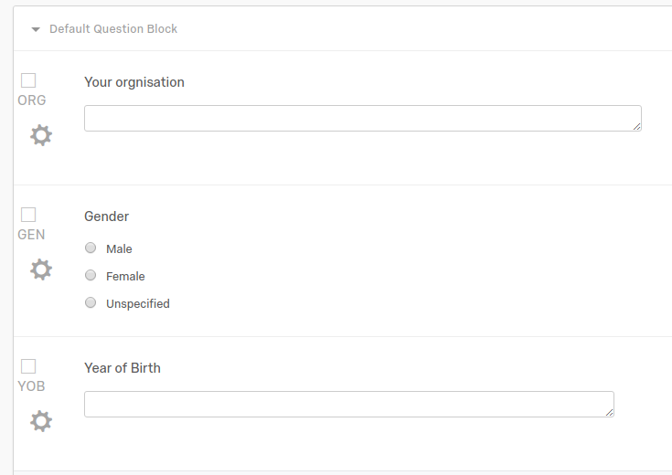
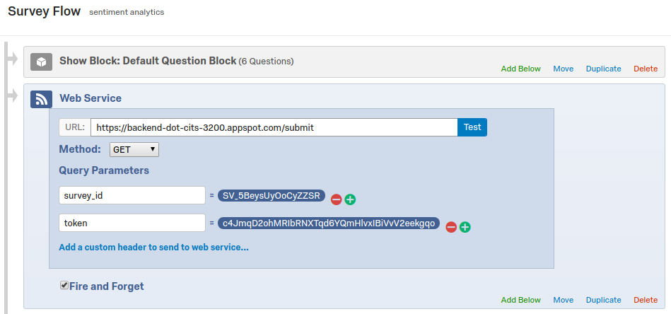

# Sentiment Analytics: Back End
[](https://travis-ci.org/krinj/cits3200-f-backend)

This is the back-end, serverless application for the Sentiment Analytics app for CITS 3200. The purpose of the App is to receive survey response submissions from Qualtrics, process those responses via the Google Natural Language API, and upload the results to a Google BigQuery table.


## Contents

* [Overview](#overview)
* [Setup](#setup)
* [Configuration](#configuration)
* [Question ID](#question-id)
* [API](#api)


## Overview

* The App is serverless, and is hosted on [Google App Engine](https://cloud.google.com/appengine/), Python standard environment.
* This repository has been set up with automatic deployment via [Travis CI](https://travis-ci.org/krinj/cits3200-f-backend). This means that every push to master should commence a deployment to App Engine.
* The App's API endpoint can be found here: https://backend-dot-cits-3200.appspot.com/
* The App has a function to submit test data, submit manual data, or submit data extracted from a Qualtrics API. More information on this later.


## Setup

This App has been configured to use GCP services on the account for `sentiment.analysis@learningforpurpose.org`. To follow this setup, please make sure you have access to GCP on this account.

#### Service Credentials

> Note: This step has already been completed for this reposistory. You should only need to do this again if the previous setup is no longer working, or you want to set up a new repository with another GCP user.

To use GCP services on an account, you must first have a copy of the service account key (this is usually a JSON file). [Click here to see the official instructions](https://cloud.google.com/iam/docs/creating-managing-service-account-keys). This will allow this App to log in and use the services.

But we do not want to store this key publicly, so we can let Travis encrypt it for us. [The official instructions are here](http://docs.travis-ci.com/user/encrypting-files/). Basically, copy the `json` credential file to the same directory as the Travis and run:

```bash
travis encrypt-file client-secret.json --add
```

This will create the secret keys on your Travis account, and also produce an encoded version of your credentials file. Travis will automatically decrypt this during the build process.

#### App Engine

[Make sure that GCP has the App Engine service enabled](https://cloud.google.com/endpoints/docs/frameworks/enable-api). Most of the setup for App Engine should already be in the `app.yaml` file.

```
service: backend
runtime: python37
```

> By default, this App will be created under the service name `backend`. I do believe though that App Engine also requires at least one app without a defined service name (i.e. default service) in order to function. So if it errors, you might need to create a simple default service, or just uncomment this line to deploy it to the default tag


## Question ID

In order to set up the survey for the pipeline to process, we must use some specific question tags to tell the back-end which questions to process. Any fields without the tagged questions will be ignored. A survey should contain each one of the tag options, otherwise it might not process properly.




| Tag   | Description                                                  |
| ----- | ------------------------------------------------------------ |
| `YOB` | Year of birth.                                               |
| `ORG` | The organization that this person belongs to.                |
| `GEN` | Gender.                                                      |
| `EMP` | Employment status.                                           |
| `NLP` | Any question tagged with `NLP` at the start will be processed as a NLP text question. For example: `NLP_Q1` and `NLP_Q2` will be processed by the pipeline. `Q3` will not. |


## Configuration

There are a couple of fields hard-coded into the `main.py` script (which is the main program). This helps to define the settings for the app.

You may modify these fields, and re-commit the repository to change the hard-coded settings (although this is something you shouldn't need to do or change).

In `main.py` you should find these lines near the top:

```python
K_DATASET = "analytics"
K_TABLE = "responses"
K_NLP_TAG = "nlp_"
```

| Field Name  | Description                                                  |
| ----------- | ------------------------------------------------------------ |
| `K_DATASET` | The name of the BigQuery data set to push this data to.      |
| `K_TABLE`   | The name of the BigQuery table to push this data to.         |
| `K_NLP_TAG` | Will only process responses which have a `question_id` that begin with this tag. |


## API

Once the App is running, you can basically 'use' it by simply sending a GET or POST request to one of its routes. For some of these, you can even just visit it in a web browser to see the result.

#### Index

**Route**: https://backend-dot-cits-3200.appspot.com/
You can visit this route in the browser just to confirm that the server is live. It should display some text like: `CITS 3200: Backend Server`.

#### Test Submit

**Route**: https://backend-dot-cits-3200.appspot.com/test_submit
If you visit this URL, or send a`GET` or `POST` request to this route, it will execute a dummy submission with randomized data. The data will still be processed through the actual NLP service on the attached GCP account, as well as uploaded to the connected BigQuery service.

#### Debug

**Route**: https://backend-dot-cits-3200.appspot.com/debug
This route accepts a `POST` request with data specified in the `application/json` format. It will return the same JSON object back as a response.

#### Manual Submit

**Route**: https://backend-dot-cits-3200.appspot.com/manual_submit
This route accepts a `POST` request with data specified in the `application/json` format. You must provide a valid value for each of the JSON keys below for the call to be successful. This could be manually hooked up with the **Qualtrics Survey Flow** to manually send the response data, or perhaps with any other survey system of choice.

The keys that need to be included can be verified in `response_data.py`, but here is a summary.

| Key                 | Type     | Notes                                                        |
| ------------------- | -------- | ------------------------------------------------------------ |
| `organization`      | `string` |                                                              |
| `gender`            | `string` |                                                              |
| `year_of_birth`     | `string` | We should enforce the type and value limit for this on the survey front end, otherwise we can get unexpected bugs from someone submitting abnormal values. |
| `employment_status` | `string` |                                                              |
| `question_id`       | `string` | This must start with the string specified in `K_NLP_TAG` (default `nlp_`) to be valid for processing. Anything else will be ignored. |
| `question_name`     | `string` | The body of the question.                                    |
| `response`          | `string` | The body of the response.                                    |
| `survey_id`         | `string` |                                                              |
| `survey_name`       | `string` |                                                              |
| `submission_id`     | `string` |                                                              |

The timestamp of the entry will be generated by the back-end server receiving this request.

If you choose to process the data this way, then it means each distinct question will need its own **Survey Flow Web Service** to process. It is a bit of a hassle to set up, but you have more fine-grained control this way.


#### Submit

**Route**: https://backend-dot-cits-3200.appspot.com/submit
This is a `POST`/`GET` request where we can get the server to automatically unpack and submit the latest response from the Qualtrics platform. You must pass in the survey ID as a query for this to work. In the Qualtrics **Survey Flow** you can put this in as a parameter.



Otherwise, there is the option to use a direct survey id in the URL as well. This will essentially process the **latest** response from Qualtric survey through the NLP pipeline, and populate the BigQuery table with it.

Replace `<SURVEY_ID>` with your own survey ID to process. Replace `<TOKEN>` with your API token.

```
https://backend-dot-cits-3200.appspot.com/submit?survey_id=<SURVEY_ID>&token=<TOKEN>
```


